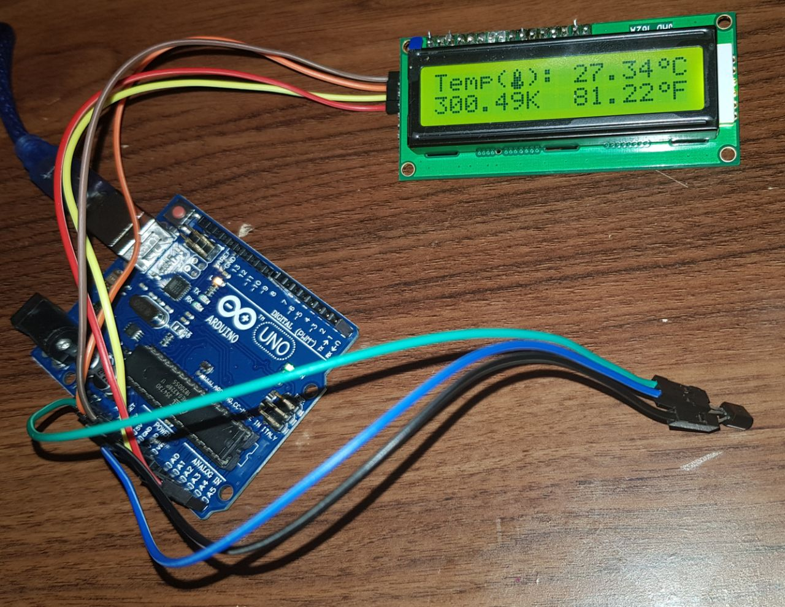

# Termômetro
Projeto em Arduino para medir a temperatura ambiente.
A temperatura é medida por um lm35 e exibida em um display LCD nas escalas de Fahrenheit, Celsius e Kelvin.

Video: https://youtu.be/37-_OJnFM-8

## Circuito

## Desenvolvedores
- Eduardo Souza Rocha
- Fabio Dias da Cunha
